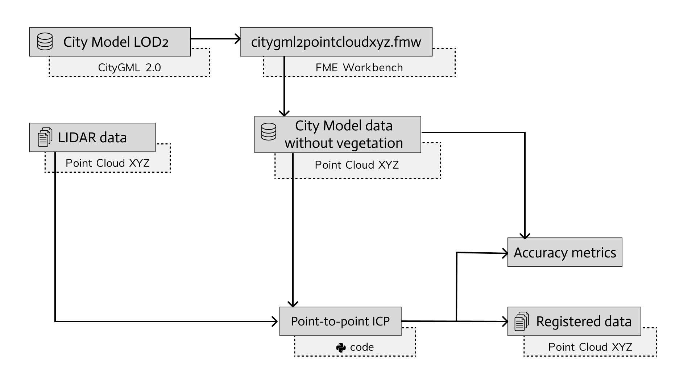
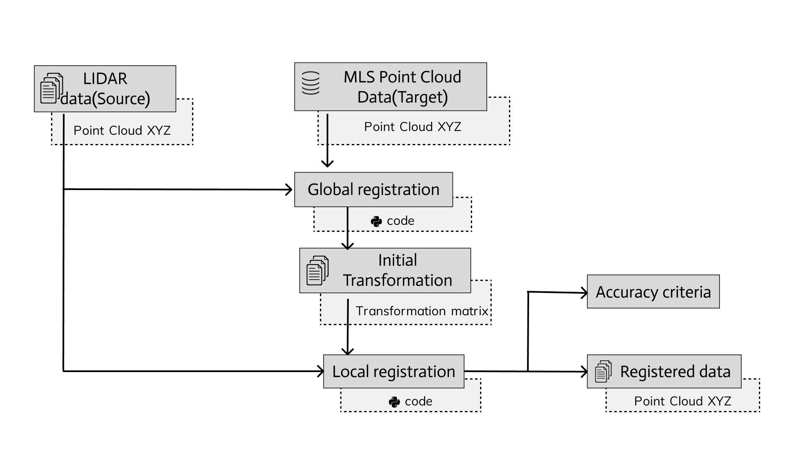

## Name
Coregistration of vehicle LiDAR point clouds with semantic road space models

## Description
This project focuses on advancing autonomous driving research through the development of a robust workflow for coregistering rich sensor datasets from test vehicles with highly accurate semantic road space models. The goal is to create an automatic annotation system for vehicle sensor data, ensuring precise alignment with semantic models relevant for machine learning applications.

The implementation of the presented workflow consists of several tools:

- The creation of point cloud based on the city model implemeted FME.
- The coregistration of LIDAR point cloud with city model point cloud is implemented using Python 3.8 and libraries Open3D and Numpy

## Point Cloud Registration 

This repository contains a Python script for point cloud registration using the Open3D library. The script performs Iterative Closest Point (ICP) registration with a Point-to-Point (p2p) approach on a target point cloud and a series of submaps.

## Usage
1. **Install** the required dependencies:
`pip install open3d matplotlib pandas`
2. **Run** the script:
`python point2point_registration.py`
Follow the prompts to provide the file path to the target point cloud, the folder containing submaps, and the registration threshold.
3. **Results** \
The script will generate various outputs: \
a) Screenshots of point clouds before and after registration in the **output/screenshots** folder.\
b) Transformation matrices in the **output/transformation_matrix** folder. \
c) Transformed submaps in the **output/submaps** folder. \
d) PDF files containing registration results in the **output/results** folder. \
e) A CSV file (**output/registration_results.txt**) summarizing the registration results.
4. **Additional Results** \
Length and roll results are saved to **output/length_and_roll_results.txt.** \
Inlier RMSE comparison plots and a plot showing the difference in Inlier RMSE are saved as **output/results/Inlier_RMSE_Comparison.png.**

## File Structure
- **point2point_registration.py**: Main script for point cloud registration.
- **output/**: Folder containing all the output files.

   - **screenshots/**: Screenshots of point clouds before and after registration.

   - **transformation_matrix/**: Transformation matrices.
   - **submaps/**: Transformed submaps.
   - **results/**: PDF and image files summarizing the registration results.
   - **length_and_roll_results.txt**: Text file containing length and roll results.
   - **registration_results.txt**: CSV file summarizing registration results.

## Requirements
- Python 3.x
- Open3D
- NumPy
- pandas
- Matplotlib

# Global and local point cloud registration

## Name:
Coregistration of vehicle LiDAR point clouds with MLS point cloud data

## Description
This Python script demonstrates the process of point cloud registration using the Open3D library. Point cloud registration involves aligning two or more point clouds to find their relative pose. The script utilizes various techniques such as downsampling, normal estimation, and feature matching to achieve accurate registration.

## Global and local point cloud registration in MLS data
Registration of the source point cloud with the MLS point cloud were obtained through the following approaches: 

1. Executing global registration and establishing the transformation matrix that aligns the source and target point clouds. 

2. Implementing Iterative point-to-point(P2P) registration utilising the transformation matrix derived from the global registration. 

3. Employing Iterative point-to-plane(P2Pl) registration based on the transformation matrix obtained from the global registration process

## Features
- Draw Registration Results: Visualize the registration results using a custom function that draws the source and target point clouds.
- Preprocess Point Cloud: Implement a function to downsample the point cloud and estimate normals, preparing it for feature extraction.
- Global Registration: Use RANSAC-based feature matching for global point cloud registration.

   ****Iterative Closest Point (ICP):****
- Point-to-Point ICP: Apply ICP using point-to-point correspondence for fine alignment.
- Point-to-Plane ICP: Utilize ICP with point-to-plane correspondence for more accurate registration.

# Usage
1. Load two point clouds (source and target) and initialize their pose.
1. Downsample and preprocess the point clouds.
1. Perform global registration using RANSAC.
1. Apply ICP for finer registration with both point-to-point and point-to-plane correspondence.

# Requirements
- NumPy
- Open3D
- Instructions
- Set the input_folder and output_folder variables to specify the location of your point cloud files.
- Adjust the voxel_size variable to control the downsampling level.
- Run the script to visualize the registration process.
- Feel free to experiment with different datasets and parameters to observe their impact on the registration results.

** Disclaimer: This work is the result of a research conducted by Amirarsalan Ehsani,Svetlana Zubareva, Sumeer Koirala and Yusuf Şimşir. the contribution of my colleagues played a significant role in realizing this project. This code is somewhat obsolete and can be used for production use in case of having a certain structure and having LOD and MLS data and FME application. **

